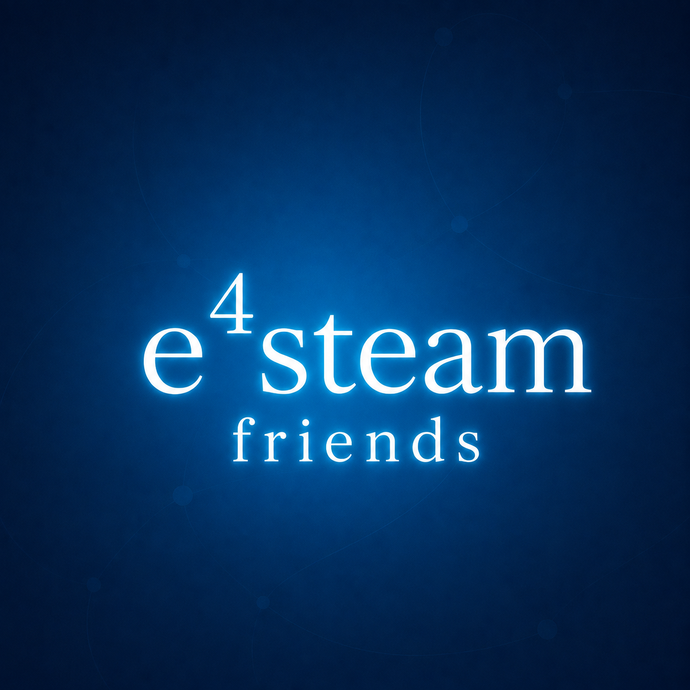

<div align="center">


# e4steam

### Play Minecraft with friends through Steam

### Играйте с друзьями в Minecraft через Steam

🇬🇧 **English** · [🇷🇺 **Русский**](#русская-версия)

<a href="https://discord.gg/zFvrHz2ys7" title="Join the K2 Studio Discord"></a>
<a href="https://t.me/K2Studio_Dev" title="K2 Studio Telegram channel"></a>
<a href="https://dalink.to/kamilchik1231" title="All project links on DAlink"></a>
<a href="https://www.curseforge.com/minecraft/mc-mods/e4steam" title="Download on CurseForge"></a>
<a href="https://github.com/Kamilhik/e4steam" title="GitHub repository"></a>
<a href="https://modrinth.com/project/SqqdJF90" title="View on Modrinth"></a>
<a href="https://youtu.be/KJ1W_eJ2VK4" title="Watch the demonstration"></a>

[](https://github.com/Kamilhik/e4steam/releases)
[](https://github.com/Kamilhik/e4steam/actions/workflows/ci.yml)
[](https://central.sonatype.com/artifact/io.github.kamilhik/e4steam-api/1.0.0)
[](LICENSE)

**🇷🇺 Русская версия находится ниже — [открыть](#русская-версия)**

</div>

## Start here

| I want to... | Open |
| --- | --- |
| Install the mod and play with a friend | [Getting started](docs/GETTING_STARTED.md) |
| Read the same guide in Russian | [Начало работы](docs/GETTING_STARTED_RU.md) |
| Choose the correct JAR | [Compatibility matrix](COMPATIBILITY.md) |
| Fix a Steam startup error | [Steam troubleshooting](docs/STEAM_TROUBLESHOOTING.md) |
| Run a dedicated server | [Dedicated-server guide](docs/DEDICATED_SERVER.md) |
| Create an addon | [Addon API guide](docs/ADDON_API.md) or [на русском](docs/ADDON_API_RU.md) |
| Browse every guide | [Documentation index](docs/README.md) |

> [!IMPORTANT]
> **e4steam 0.3.1 is a full release.** Windows x64 is the primary supported
> platform, including integrated worlds and dedicated servers. Linux x64 and
> macOS are available as experimental builds. e4steam permanently uses Valve's
> shared test App ID 480 (Spacewar), so it filters unrelated App ID 480 traffic.

> [!NOTE]
> Version 0.3.1 extends Steam-only dedicated servers to every retro release
> JAR, fixes Forge 1.17.1 startup, removes bundled UniMixins from Forge 1.7.x
> and makes the Unix Steam Overlay relaunch opt-in.
> Authenticated Windows x64 joins were manually verified on NeoForge 1.21.1,
> Fabric 26.2 and Forge 1.12.2 dedicated servers. Linux, macOS and the full
> cross-platform matrix still need more manual coverage.

e4steam opens a Minecraft singleplayer world to Steam friends without port
forwarding or a public IP. Both players need the mod and a signed-in Steam
client. Minecraft TCP traffic and supported voice-chat UDP traffic travel over
Steam P2P or Valve relays.

Offline Minecraft launcher profiles are supported for Steam connections. Since
0.3.0, the host derives each Steam guest's stable Minecraft
UUID and safe profile name from the authenticated SteamID rather than trusting
the name supplied by the client. Steam itself must still be running and signed
in on every computer.

When upgrading a world first played through e4steam 0.2.4, a guest can appear
with fresh progress once because 0.3.0 replaces the old Mojang/offline UUID
with the stable Steam-derived UUID. Back up the world before migrating the
matching `world/playerdata/<old UUID>.dat`; later 0.3.0+ joins reuse the same
Steam-derived UUID.

## What's new in 0.3.1

Compared with 0.3.0, this version adds protected Steam-only dedicated-server
entry paths to every retro Forge and Fabric artifact, prints the dedicated
address only after the server is ready, and fixes the Forge 1.17.1 lifecycle
crash. The Forge 1.7.x JAR now uses an external UniMixins 0.1.20+ installation
instead of embedding duplicate component mods. Linux and macOS gain a safer,
explicitly enabled pre-LWJGL overlay relaunch; legacy Forge on macOS keeps its
normal window path to avoid hidden or repeatedly restarted JVMs. See the full
[changelog](CHANGELOG.md) for verification details.

The repository also contains a separate loader-independent Java 8 API artifact, an
addon testkit and a compile-checked example. API 1.0 includes scoped
identity, session, dedicated, access, lobby, negotiated network, UDP, UI,
command, config, storage, world-settings, modpack, skin, diagnostics,
localization and logging contracts. Addons are discovered only through the
installed mod loader or Java service metadata; core never scans or downloads
arbitrary JAR files. See the [Addon API guide](docs/ADDON_API.md) and the
[compatibility matrix](COMPATIBILITY.md).

### Addon API for developers

The stable **e4steam Addon API 1.0.0** is published on
[Maven Central](https://central.sonatype.com/artifact/io.github.kamilhik/e4steam-api/1.0.0).
No custom Maven repository is required:

```groovy
dependencies {
    compileOnly("io.github.kamilhik:e4steam-api:1.0.0")
}
```

[Full Addon API documentation](docs/ADDON_API.md)

This API is not a sandbox: an installed addon is ordinary code in the same JVM
and must come from a trusted source. Core does not expose Steam passwords,
auth tickets, invite tokens, GSLT, native handles or raw protocol hooks.
Public Worlds, Modpack Sync, Offline Skins and World Settings are separate
addon ideas. Their bounded API contracts exist, but core does not include
those user-facing features.

## Addons

Addon API 1.0 and addon support are stable parts of e4steam 0.3.1. Addons are
installed as normal loader mods; check each addon's version requirements.

### Client add-ons

| Icon | Add-on | Description |
| :---: | --- | --- |
| <br><sub>CLIENT</sub> | [**e4steam Friends**](https://github.com/K2-Studio-Development/e4steam-Friends) | A Minecraft-style Steam friends screen with presence, search, invitations, joining and join requests.<br>**Minecraft 26.2 · Fabric / NeoForge** |

Developers can start with the [Addon API guide](docs/ADDON_API.md), the
[testkit](api-testkit) and the compile-checked [example addon](example-addon).

Installed addons are ordinary code in the Minecraft JVM. Use only addons from
sources you trust; e4steam does not download or execute addons automatically.

## Which file should I download?

| Minecraft | Loader | File name contains | Extra dependency |
| --- | --- | --- | --- |
| 1.17–1.18.2 | Fabric/Quilt | `fabric-quilt-mc1.17-1.18.2` | Fabric API |
| 1.17.1–1.18.1 | Forge | `forge-mc1.17.1-1.18.1` | None |
| 1.19–1.21.x | Fabric/Quilt | `fabric-quilt-mc1.19-1.21.11` | Fabric API |
| 1.18.2–1.20.2 | Forge | `forge-mc1.18.2-1.20.2` | None |
| 1.20.2–1.21.x | NeoForge | `neoforge-mc1.20.2-26.2` | None |
| 26.1–26.2 | Fabric/Quilt or NeoForge | file containing `mc26.1-26.2` | Fabric API only for Fabric/Quilt |

The 0.3.1 release also includes retro JARs in `release/0.3.1`: Forge branch
JARs from `1.7.x` through `1.16.x`, and Fabric
branch JARs from `1.14.x` through `1.16.x`. Every filename identifies its loader
and minor branch. Fabric still requires the matching Fabric API. A successful
baseline test does not automatically prove every patch in that `.x` branch.

Forge `1.7.x` additionally requires one separate **UniMixins 0.1.20 or newer**
JAR. e4steam no longer embeds UniMixins or any of its component mods, so an
existing modpack copy can be used without duplicate-mod errors.

Each listed 0.3.1 JAR contains the required 64-bit Steam native libraries for
Windows, Linux and macOS. Download one file for your Minecraft version and
loader; there are no separate per-OS builds. Linux and macOS remain
experimental until their manual matrices are complete.

Declared ranges are broader than the manually tested matrix. Retro branch JARs
are supported release files; [COMPATIBILITY.md](COMPATIBILITY.md) records exact
manual coverage separately. Linux and macOS remain experimental.

## Installation

1. Install the loader matching your Minecraft version.
2. Download the matching e4steam JAR from [GitHub Releases](https://github.com/Kamilhik/e4steam/releases), [CurseForge](https://www.curseforge.com/minecraft/mc-mods/e4steam), or [Modrinth](https://modrinth.com/mod/e4steam).
3. Put the JAR in the instance's `mods` folder. Fabric and Quilt also require Fabric API.
4. Install the same e4steam release on every player's computer.
5. Start Steam and sign in before launching Minecraft.

## Playing

1. Open a singleplayer world.
2. Select **Open to LAN → Steam friends** or **Invitation only**.
3. Press **Invite friends** and send the invitation in the Steam overlay.
4. Your friend accepts the invite and confirms joining in Minecraft.

Simple Voice Chat is detected automatically. Plasmo Voice is supported when it
shares Minecraft's port. Another UDP mod can use the `voiceChatPort` setting.

## Dedicated servers

Install the same loader/version JAR on a headless Minecraft server; there is no
separate server download. The server signs in anonymously through the Steam
GameServer API, keeps Minecraft bound to loopback and prints a `d-...steam`
address when it is ready. Send that address to players, who paste it into
Minecraft's server address field. No personal Steam account, desktop Steam
client or GSLT is required on the server.

Windows x64 dedicated servers are supported. Recorded checks cover NeoForge
1.21.1, Fabric 26.2 and Forge 1.12.2; Linux and macOS remain experimental.
Setup, access modes and commands are covered in the
[dedicated-server guide](docs/DEDICATED_DEPLOYMENT.md).

Addon developers can observe readiness, player count and lifecycle state
through `DedicatedServerService`; controlled drain and publication proposals
use separate capabilities. See the [Addon API guide](docs/ADDON_API.md).

## If an invitation does not arrive

For `SteamAPI_Init failed`, first follow the
[Steam startup troubleshooting guide](docs/STEAM_TROUBLESHOOTING.md).

- Confirm both players are Steam friends, online, and using the same e4steam release.
- Confirm both use the same Minecraft version and compatible loaders.
- Make sure the Steam desktop client is running and signed in, then restart Minecraft.
- Ask the host to close and reopen the Steam connection, then send a new invite.
- For a friends-only lobby, copy the green e4steam address as a fallback.
- Restart Steam if Spacewar presence or the overlay is stuck.
- On Linux x64 or macOS x86_64/arm64, see the
  [Steam overlay relaunch guide](docs/UNIX_OVERLAY.md). The experimental
  relaunch is disabled by default because some launcher/loader combinations
  can hang, crash or restart repeatedly. Steam invitations and copied addresses
  work without overlay injection.

## Known limitations

- App ID 480 is a shared test namespace and is not exclusive to e4steam.
- Windows x64 integrated worlds and dedicated servers are supported. Linux x64
  and macOS remain experimental. The full two-client and cross-platform
  dedicated matrix is still pending.
- 32-bit operating systems are unsupported.
- Both players need Steam, e4steam, matching Minecraft versions, and compatible loaders.
- Check the compatibility matrix for the exact versions and loaders that were manually smoke-tested.
- The shared world uses Minecraft's standard limit of 8 players including the host.

## Demo

[](https://youtu.be/KJ1W_eJ2VK4)


---

<details id="русская-версия">
<summary><h2>🇷🇺 Русская версия — нажмите, чтобы открыть</h2></summary>

> [!IMPORTANT]
> **e4steam 0.3.1 — полноценный релиз.** Основная поддерживаемая платформа —
> Windows x64, включая открытые миры и выделенные серверы. Сборки для Linux x64
> и macOS пока экспериментальные. Мод постоянно использует общий тестовый
> Steam App ID 480 (Spacewar) и фильтрует посторонний трафик этого App ID.

> [!NOTE]
> В версии 0.3.1 защищённый Steam-only вход выделенных серверов добавлен во все
> retro-JAR, исправлен запуск Forge 1.17.1, из Forge 1.7.x убраны встроенные
> компоненты UniMixins, а Unix-реланч Steam Overlay сделан явно включаемым.
> Под Windows x64 вручную проверены авторизованные подключения к
> серверам NeoForge 1.21.1, Fabric 26.2 и Forge 1.12.2. Для Linux, macOS и
> межплатформенных подключений ещё собирается полная матрица результатов.

e4steam позволяет открыть одиночный мир Minecraft друзьям из Steam без проброса
портов и белого IP. Мод и запущенный Steam нужны у всех игроков. TCP-трафик
Minecraft и UDP-трафик поддерживаемых голосовых модов передаются через Steam P2P
или ретрансляторы Valve.

Офлайн-профили Minecraft-лаунчеров поддерживаются для подключений через Steam.
Начиная с 0.3.0 хост создаёт стабильный Minecraft UUID и безопасное
имя гостя из подтверждённого SteamID, а не доверяет имени, присланному клиентом.
Сам Steam всё равно должен быть запущен, и на каждом компьютере должен быть
выполнен вход в аккаунт Steam.

После обновления мира, который раньше использовался с e4steam 0.2.4, гость
может один раз появиться без старого прогресса: 0.3.0 заменяет прежний
Mojang/offline UUID стабильным UUID из SteamID. Перед переносом подходящего
`world/playerdata/<старый UUID>.dat` сделайте резервную копию мира. Все
следующие входы в 0.3.0 и новее используют тот же UUID, вычисленный из SteamID.

## Что нового в 0.3.1

По сравнению с 0.3.0 защищённый Steam-only вход выделенного сервера добавлен
во все retro-сборки Forge и Fabric, адрес сервера выводится только после полной
готовности, а вылет Forge 1.17.1 при запуске исправлен. Forge 1.7.x теперь
использует отдельно установленный UniMixins 0.1.20+ и не создаёт дубликаты его
внутренних модов. На Linux и macOS появился более безопасный реланч до LWJGL,
который включается только явно; старые версии Forge на macOS сохраняют обычный
запуск окна, чтобы JVM не исчезала из Dock и не перезапускалась несколько раз.
Подробности перечислены в [changelog](CHANGELOG.md).

В репозитории также есть отдельный Java 8 API JAR, не зависящий от загрузчика,
набор средств для тестов и пример аддона, который проверяется при сборке. API
1.0 содержит отдельные контракты для идентификаторов, сессий, выделенных
серверов, доступа, лобби, сетевых каналов, UDP, интерфейса, команд, настроек,
хранилища, диагностики и локализации. Аддоны обнаруживает обычный загрузчик
модов или Java `ServiceLoader`; ядро не ищет и не скачивает произвольные JAR.
Подробности: [Addon API](docs/ADDON_API_RU.md) и
[матрица совместимости](COMPATIBILITY.md).

### Addon API для разработчиков

Стабильный **e4steam Addon API 1.0.0** опубликован в
[Maven Central](https://central.sonatype.com/artifact/io.github.kamilhik/e4steam-api/1.0.0).
Сторонний Maven-репозиторий добавлять не нужно:

```groovy
dependencies {
    compileOnly("io.github.kamilhik:e4steam-api:1.0.0")
}
```

[Полная документация Addon API](docs/ADDON_API_RU.md)

API не является песочницей: установленный аддон — обычный код в той же JVM,
поэтому ставить можно только доверенные моды. Ядро не выдаёт пароли Steam,
билеты авторизации, токены приглашений, GSLT, нативные дескрипторы и доступ к
сырым пакетам протокола.
Для Public Worlds, Modpack Sync, Offline Skins и World Settings есть только
ограниченные API-контракты. Самих пользовательских функций в core пока нет.

## Аддоны

Addon API 1.0 и поддержка аддонов — стабильные части e4steam 0.3.1. Аддоны
устанавливаются как обычные моды; точные требования указаны на их страницах.

### Клиентские аддоны

| Иконка | Аддон | Описание |
| :---: | --- | --- |
| <br><sub>CLIENT</sub> | [**e4steam Friends**](https://github.com/K2-Studio-Development/e4steam-Friends) | Экран друзей Steam в стиле Minecraft: статусы, поиск, приглашения, подключение и запросы на вход.<br>**Minecraft 26.2 · Fabric / NeoForge** |

Для разработчиков есть [руководство Addon API](docs/ADDON_API_RU.md),
[testkit](api-testkit) и проверяемый сборкой [пример](example-addon).

Установленный аддон — обычный код внутри JVM Minecraft. Используйте только
доверенные источники: e4steam сам не скачивает и не запускает аддоны.

## Какой файл скачивать

| Minecraft | Загрузчик | В названии файла | Дополнительно |
| --- | --- | --- | --- |
| 1.17–1.18.2 | Fabric/Quilt | `fabric-quilt-mc1.17-1.18.2` | Fabric API |
| 1.17.1–1.18.1 | Forge | `forge-mc1.17.1-1.18.1` | Ничего |
| 1.19–1.21.x | Fabric/Quilt | `fabric-quilt-mc1.19-1.21.11` | Fabric API |
| 1.18.2–1.20.2 | Forge | `forge-mc1.18.2-1.20.2` | Ничего |
| 1.20.2–1.21.x | NeoForge | `neoforge-mc1.20.2-26.2` | Ничего |
| 26.1–26.2 | Fabric/Quilt или NeoForge | файл с `mc26.1-26.2` | Fabric API только для Fabric/Quilt |

В релиз 0.3.1 также входят retro-сборки из `release/0.3.1`: веточные Forge JAR
от `1.7.x` до `1.16.x` и Fabric JAR от `1.14.x` до `1.16.x`.
В названии указаны загрузчик и ветка Minecraft. Для Fabric по-прежнему нужен
подходящий Fabric API. Проверка основной версии не доказывает автоматически
работу каждого патча внутри ветки `.x`.

Для Forge `1.7.x` дополнительно нужен один отдельный JAR **UniMixins 0.1.20 или
новее**. e4steam больше не встраивает UniMixins и его внутренние моды, поэтому
можно использовать уже установленную в сборке версию без ошибки дубликатов.

Каждый JAR 0.3.1 содержит необходимые 64-битные библиотеки Steam для Windows,
Linux и macOS. Для своей версии Minecraft и загрузчика нужно скачать один файл
— отдельных сборок по ОС нет. Linux и macOS остаются экспериментальными до
завершения ручных проверок.

Заявленный диапазон шире проверенной матрицы. Retro JAR являются поддерживаемыми
файлами релиза, а [COMPATIBILITY.md](COMPATIBILITY.md) отдельно показывает точное
ручное покрытие. Linux и macOS остаются экспериментальными.

## Как установить мод

1. Установите загрузчик, подходящий вашей версии Minecraft.
2. Скачайте нужный JAR с [GitHub Releases](https://github.com/Kamilhik/e4steam/releases), [CurseForge](https://www.curseforge.com/minecraft/mc-mods/e4steam) или [Modrinth](https://modrinth.com/mod/e4steam).
3. Поместите JAR в папку `mods`. Для Fabric и Quilt также установите Fabric API.
4. Установите одинаковый релиз e4steam всем игрокам.
5. Запустите Steam и войдите в аккаунт до запуска Minecraft.

## Как играть

1. Откройте одиночный мир.
2. Выберите **Открыть для сети → Для друзей Steam** или **Только по приглашению**.
3. Нажмите **Пригласить друзей** и отправьте приглашение через оверлей Steam.
4. Друг принимает приглашение и подтверждает вход в Minecraft.

Simple Voice Chat определяется автоматически. Plasmo Voice поддерживается,
когда использует порт Minecraft. Для другого UDP-мода укажите `voiceChatPort`.

## Выделенные серверы

На сервер без графического интерфейса ставится тот же JAR для нужной версии
Minecraft и загрузчика; отдельного серверного файла нет. e4steam анонимно
входит через Steam GameServer, оставляет Minecraft доступным только через
локальный мост и печатает адрес `d-...steam`, когда сервер готов. Игрок
вставляет этот адрес
в поле подключения к серверу. Личный аккаунт Steam, настольный клиент Steam и
GSLT на серверном ПК не нужны.

Выделенные серверы поддерживаются на Windows x64. Вручную проверены NeoForge
1.21.1, Fabric 26.2 и Forge 1.12.2; Linux и macOS пока экспериментальные.
Настройка, режимы доступа и команды описаны в
[инструкции по выделенному серверу](docs/DEDICATED_DEPLOYMENT.md).

Аддоны могут читать состояние и готовность сервера через
`DedicatedServerService`. Для остановки и предложения внешней публикации
нужны отдельные разрешения API. Пример есть в
[документации Addon API](docs/ADDON_API_RU.md).

## Если приглашение не приходит

Если появляется `SteamAPI_Init failed`, сначала откройте
[инструкцию по диагностике запуска Steam](docs/STEAM_TROUBLESHOOTING.md).

- Проверьте, что вы друзья в Steam, оба онлайн и используете одинаковый релиз e4steam.
- Проверьте совпадение версии Minecraft и совместимость загрузчиков.
- Убедитесь, что клиент Steam запущен и выполнен вход, затем перезапустите Minecraft.
- Закройте соединение, откройте его заново и отправьте новое приглашение.
- В режиме для друзей можно скопировать зелёный адрес как запасной вариант.
- Перезапустите Steam, если статус Spacewar или оверлей завис.
- На Linux x64 и macOS x86_64/arm64 можно включить дополнительный
  [перезапуск для оверлея Steam](docs/UNIX_OVERLAY.md). Экспериментальный
  реланч по умолчанию выключен: некоторые сочетания лаунчера и загрузчика могут
  зависать, падать или перезапускаться несколько раз. Приглашения Steam и адрес
  работают без внедрения overlay.

## Известные ограничения

- App ID 480 — общий тестовый идентификатор, не принадлежащий e4steam.
- Открытые одиночные миры и выделенные серверы на Windows x64 поддерживаются.
  Linux x64 и macOS имеют статус experimental. Полная матрица выделенных
  серверов с двумя клиентами и другими ОС ещё не завершена.
- 32-битные системы не поддерживаются.
- Всем нужны Steam, e4steam, одинаковая версия Minecraft и совместимые загрузчики.
- Точные вручную проверенные версии и загрузчики перечислены в матрице совместимости.
- Открытый мир использует стандартный лимит Minecraft: 8 игроков вместе с хостом.

</details>

---

Created and maintained by **Kamilchik**. e4steam is an unofficial fork of
[e4mc](https://github.com/vgskye/e4mc-minecraft-architectury), distributed under
the [Apache License 2.0](LICENSE), and is not affiliated with Valve, Mojang, or Microsoft.
